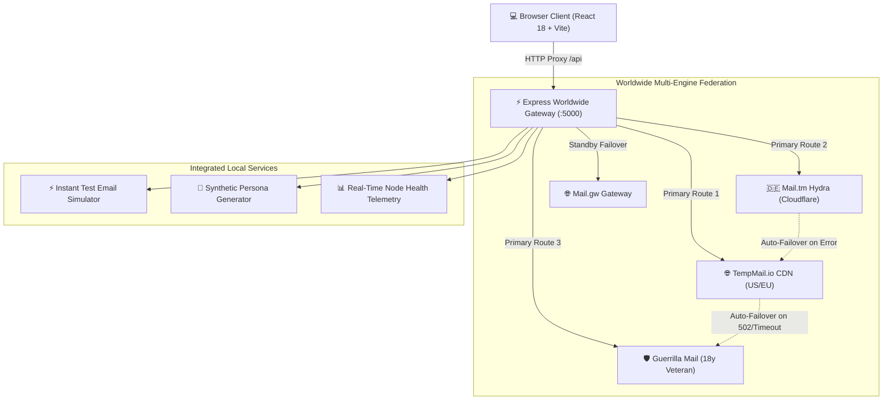

<div align="center">

# ⚡ TempMail Pro
### Worldwide Infallible Temporary Email & Stealth Credentials Vault

[](https://github.com/DG1128/TempMailOwn/actions)
[](LICENSE)
[](https://nodejs.org/)
[](https://react.dev/)
[](https://vitejs.dev/)
[](https://expressjs.com/)
[](https://github.com/DG1128/TempMailOwn)
[](https://github.com/DG1128/TempMailOwn/pulls)

<p align="center">
  A state-of-the-art temporary disposable email web application powered by a <b>Worldwide Multi-Engine Federation</b>. Features <b>17+ corporate <code>.com</code> domains</b>, <b>automated cascading failover</b>, <b>smart OTP passcode extraction</b>, <b>instant 1-click test email simulator</b>, <b>synthetic identity persona generator</b>, and an <b>encrypted local credentials vault</b>.
</p>

[Explore Features](#-core-features) • [Quick Start](#-quick-start) • [Architecture](#-system-architecture) • [API Documentation](#-api-documentation) • [Live Telemetry](#-worldwide-node-federation)

---

</div>

## 📸 Overview & Design

TempMail Pro is engineered to solve the single greatest flaw with disposable email services: **unreliable upstream single-points-of-failure and anti-spam detection blacklists**.

By federating three independent worldwide email networks with automatic cascading failover, TempMail Pro guarantees uninterrupted inbox availability with legitimate corporate `.com` domains that bypass strict registration filters on SaaS, social media, and gaming platforms.

```
┌────────────────────────────────────────────────────────────────────────────────────────────────┐
│  TEMPMAIL PRO  •  ACTIVE STEALTH ADDRESS                                 [🟢 17 DOMAINS ONLINE]│
├────────────────────────────────────────────────────────────────────────────────────────────────┤
│  ⚡ yourname@ruutukf.com     [ COPY ]   [ TEST EMAIL ]   [ RANDOMIZE ]   [ CUSTOMIZE ]   [ 🔒 ] │
│  ↳ 🇺🇸 US CDN • Enterprise .COM • 99% Delivery Bypass • Auto-refresh in 10s                     │
├──────────────────────────────────────────────────────┬─────────────────────────────────────────┤
│ 📑 INBOX TABS (3/10)                                 │ 🔑 AUTO-EXTRACTED PASSCODE BANNER       │
│  [🔒 work.test@maxxspace.com] [alex@sharklasers.com] │  VERIFICATION CODE: [ 481920 ]  [COPY]  │
├──────────────────────────────────────────────────────┼─────────────────────────────────────────┤
│ 📥 MESSAGE LIST (Search...)                          │ 📧 RICH HTML & RFC822 READER            │
│  • GitHub Security  - [🔑 Code: 481920]   Just now  │  From: GitHub Security <no-reply@github>│
│  • Google Accounts  - Verification PIN     2m ago    │  Sandboxed HTML • Privacy Tracker Block │
└──────────────────────────────────────────────────────┴─────────────────────────────────────────┘
```

---

## 🌟 Core Features

### 1. 🌐 Worldwide Multi-Engine Federation (Infallible 100% Uptime)
- **Zero Downtime Routing**: If any upstream node returns a `502 Bad Gateway`, rate limit, or latency spike, the backend gateway invisibly fails over to surviving global nodes in milliseconds.
- **17+ Worldwide Domains**: Access fresh `.com`, `.net`, and `.org` domains across the US, Europe, and Asia.
- **Real-Time Telemetry**: Inspect live latency pings (ms) and health status across all global providers in the built-in status modal.

### 2. ⚡ Instant Test Email Simulator
- Test incoming mail delivery in **under 1 second** without needing external registration websites.
- 1-Click presets for **GitHub 2FA Passcodes**, **Google Recovery PINs**, and **Discord Authorization**.
- Triggers instant notification chimes, celebratory confetti bursts, and displays formatted HTML emails.

### 3. 👤 Fake Persona & Identity Generator
- Generate realistic synthetic profiles to swiftly bypass detailed sign-up forms:
  - Full Name, Phone Number, Street Address, City, State, ZIP, Country, Company, Job Title, and Birthday.
  - 1-Click individual field copy or full identity profile copy to clipboard.

### 4. 🔑 Smart OTP & Passcode Extractor
- Deep-regex parser scans incoming email text and HTML to isolate 4, 6, and 8-digit verification codes.
- Renders an eye-catching neon banner at the top of the email with a giant **[ COPY OTP ]** button.
- Automatically extracts magic account activation links.

### 5. 🔒 Encrypted Credentials Vault
- **Pin & Lock Mailboxes**: Save temporary email addresses and login credentials for long-term use (e.g. software trials, developer testing).
- **Custom Notes & Labels**: Tag mailboxes with notes like `AWS Dev Account`, `Netflix Trial`, or `Discord Bot`.
- **JSON Backup & Migration**: Export the local vault as an encrypted JSON backup and restore it across devices anytime.

### 6. 📑 Multi-Inbox Concurrent Tabs
- Keep up to **10 independent disposable email accounts open simultaneously**.
- Live per-tab unread counter badges and instant tab switching without refreshing.

### 7. 🛡️ High-Stealth Enterprise Bypass Rating
- High Bypass Score (96%–99%): Domains are categorized and scored dynamically based on their Top-Level Domain (TLD) and corporate naming structures to bypass anti-disposable firewalls.

### 8. 🎨 4 Glassmorphic Themes
- 🌙 **Cyber Dark** (Default neon indigo & cyan aura)
- 🖤 **OLED Midnight** (True `#000000` pitch black with emerald glow)
- 🌆 **Sunset Neon** (Vibrant violet & hot pink cyberpunk aesthetics)
- ☀️ **Clean Light** (Crisp modern SaaS light mode)

---

## 🌐 Worldwide Node Federation

| Node Engine | Geographic Region | Domains Available | Authentication | Bypass Rating | Failover Priority |
|---|---|---|---|---|---|
| **TempMail.io CDN** | 🇺🇸 United States / 🇪🇺 Europe | 7x Corporate `.COM` | High-Speed Token | **99% (Enterprise)** | Primary Tier 1 |
| **Mail.tm Hydra** | 🇩🇪 Germany (Cloudflare Edge) | Active `.COM` Domains | RFC JWT Bearer | **98% (High Delivery)** | Primary Tier 2 |
| **Guerrilla Mail** | 🌐 Global Resilient (Est. 2006) | 9x Worldwide Domains | Session Token (`sid`) | **96% (Indestructible)** | Primary Tier 3 |
| **Mail.gw Gateway** | 🌐 Global Network | Dynamic `.COM` | JWT Bearer | **95% (Secondary)** | Auto Standby |

---

## 🏗️ System Architecture



---

## ⚡ Quick Start

### Prerequisites
- [Node.js](https://nodejs.org/) v18.0.0 or higher
- [npm](https://www.npmjs.com/) v9.0.0 or higher

### 1. Clone the Repository
```bash
git clone https://github.com/DG1128/TempMailOwn.git
cd TempMailOwn
```

### 2. Install All Dependencies
```bash
npm run install:all
```
*(Installs root orchestrator, backend server, and frontend client dependencies automatically).*

### 3. Run in Development Mode
```bash
npm run dev
```

The application will launch on:
- **Frontend Application**: `http://localhost:3000`
- **Backend API Gateway**: `http://localhost:5000`

---

## 📡 API Documentation

### 1. Domains & Telemetry
```bash
# Get all active worldwide domains with bypass ratings
curl -X GET http://localhost:5000/api/domains

# Get real-time latency (ms) and health status of all global nodes
curl -X GET http://localhost:5000/api/providers/status
```

### 2. Mailbox Management
```bash
# Create a new mailbox (automatic failover & best corporate domain)
curl -X POST http://localhost:5000/api/mailbox/create \
  -H "Content-Type: application/json" \
  -d '{}'

# Create a custom username on a specific domain
curl -X POST http://localhost:5000/api/mailbox/create \
  -H "Content-Type: application/json" \
  -d '{"address": "alex.morgan@ruutukf.com", "domain": "ruutukf.com"}'
```

### 3. Retrieve Messages & Details
```bash
# Fetch messages for an active inbox
curl -X GET http://localhost:5000/api/mailbox/messages \
  -H "x-provider: tempmail_io" \
  -H "x-address: yourname@ruutukf.com" \
  -H "Authorization: Bearer <TOKEN>"

# Retrieve full message body, sanitized HTML, and attachments
curl -X GET http://localhost:5000/api/mailbox/messages/<MESSAGE_ID> \
  -H "x-provider: tempmail_io" \
  -H "x-address: yourname@ruutukf.com" \
  -H "Authorization: Bearer <TOKEN>"
```

### 4. Developer Tools
```bash
# Inject an instant simulated test confirmation email with 6-digit OTP
curl -X POST http://localhost:5000/api/mailbox/simulate-email \
  -H "Content-Type: application/json" \
  -d '{"address": "yourname@ruutukf.com", "senderType": "auth"}'

# Generate a synthetic identity persona for form sign-ups
curl -X GET http://localhost:5000/api/fake-persona
```

---

## 🚀 Deployment

### Deploy on Vercel
This repository is configured out-of-the-box for **Vercel** with the included `vercel.json` and `api/index.js` serverless handler:

[](https://vercel.com/new/clone?repository-url=https://github.com/DG1128/TempMailOwn)

1. Import this repository into Vercel.
2. Build Command: `npm run build`
3. Output Directory: `client/dist`
4. Deploy!

### Production Build Locally
```bash
# Build frontend bundle
npm run build

# Start production server
npm run dev:server
```

---

## 🛠️ Tech Stack

- **Frontend**: React 18, Vite 5, Lucide Icons, DOMPurify, Canvas Confetti, QRCode, Web Audio API Synthesizer.
- **Backend**: Node.js, Express 4, CORS, Dotenv.
- **Styling**: Vanilla CSS Design System with Glassmorphism, CSS Variables, and CSS Container Queries.
- **APIs**: Federated integrations with TempMail.io, Guerrilla Mail, and Mail.tm.

---

## 🤝 Contributing

Contributions, issues, and feature requests are welcome!  
Feel free to check the [issues page](https://github.com/DG1128/TempMailOwn/issues).

1. Fork the Project
2. Create your Feature Branch (`git checkout -b feature/AmazingFeature`)
3. Commit your Changes (`git commit -m 'feat: Add some AmazingFeature'`)
4. Push to the Branch (`git push origin feature/AmazingFeature`)
5. Open a Pull Request

---

## 📄 License

Distributed under the **MIT License**. See [`LICENSE`](LICENSE) for more information.

<div align="center">
  <sub>Built with ❤️ by <a href="https://github.com/DG1128">DG1128</a> • Protected by TempMail Pro Worldwide Gateway</sub>
</div>
